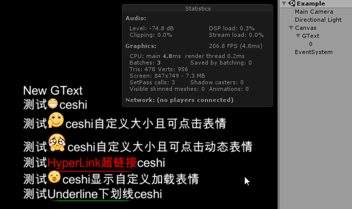
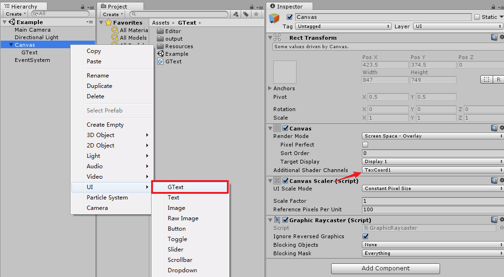

# GText (Emoji, Hyperlink and Underline for UGUI)
图文混排、超链接、下划线的UGUI解决方案

    支持：
    * 图集动态表情
    * 动态加载图片
    * 超链接
    * 下划线效果
    
**除动态加载图片，整体只有1个DrawCall**

效果图：



```
输入内容：
New GText
测试[AA]ceshi
测试[AB|36#dianji]ceshi自定义大小且可点击表情
测试[a|40#dianji]ceshi自定义大小且可点击动态表情
测试[0x01##ff0000#ClickLink=HyperLink超链接]ceshi
测试[0x02|30##00ffff#ClickImg=icons/1]ceshi显示自定义加载表情
测试<material=u#00ff00>Underline下划线</material>ceshi
```

1. 强行解释关于动态表情：

图文混排的实现使用shader的，所以无论你有多少个表情在里面，加上字体整体也只会有1个DrawCall，该功能实现参考[**EmojiText**](https://github.com/zouchunyi/EmojiText)。修改了原工程的生成的计算方式，使用‘*\u2001*’做单个占位符，在计算mesh时更好的对位置，避免在角落时出现超出的现象，支持preferredWidth等功能。Shader部分使用了UV动画的功能实现，使用texcoord1标记动画帧数、该图所在起始序号，texcoord0标记uv坐标。所以，**使用GText的组件父Canvas节点中Additional Shader Channels 必须选择TexCoord1**。

```
使用方式：
[表情名称|表情大小（可空，默认字体大小）#超链接内容（可空，如果填了点击该图片是会当超链接处理，返回超链接内容）]
```

2. 强行解释关于动态加载图片：
动态加载一张额外的图片显示在图文混排中，由于是额外加载，所以会在该组件下生成一张新的Image，这样也就会增加一个DC，如图中的GText/0。
```
使用方式：
该写GText.cs下ShowImages()的加载图片接口
[0x02（默认）|表情大小（可空，默认字体大小）#超链接内容（可空，如果填了点击该图片是会当超链接处理，返回超链接内容）=图片加载参数（非空，用于加载图片的参数，如路径）]
```

3. 强行解释超链接

```
使用方式：
[0x01（默认）##颜色值（可空，表示下划线颜色，默认字体颜色）#超链接内容（非空，点击超链接后的回调）=显示内容（非空，超链接显示的内容）]
```

4. 强行解释下划线

```
使用方式，使用unity默认标记material：
<material=u色值（色值可空，表示下划线颜色，默认字体颜色）>下划线内容</material>

u标识underline, 坐等以后增加其他效果0.0
```


**使用方式：**

* 创建图集
选中表情图片（大小最好是2的n次方）,点击Tools/Emoji Build后生成一张图集、一个材质球、一个txt文本配置。
文本配置是在GText的Awake中需要加载的，可自行更改读取方式。

* 生成组件
更改GTexBuilder.cs中的emojiMat路径为上一步生成的材质球路径，
在UI下右键UI/GText即可创建一个GText组件，创建和会默认更改父Canvas节点的Shader Channels

